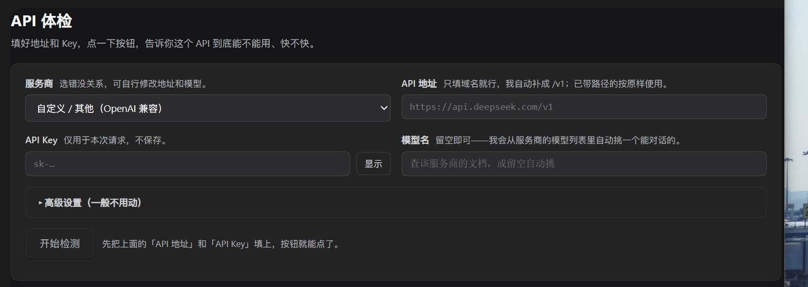
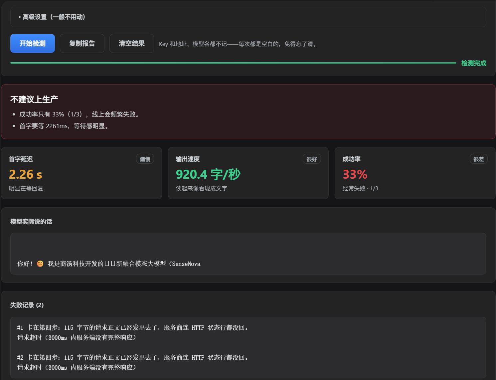
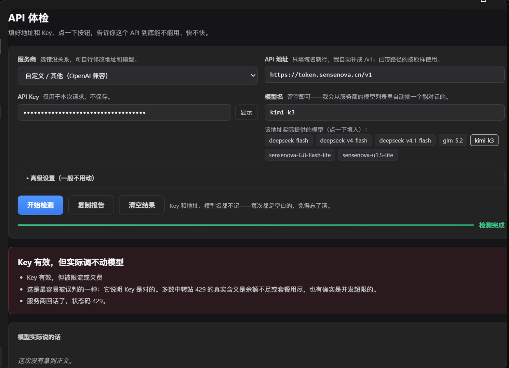
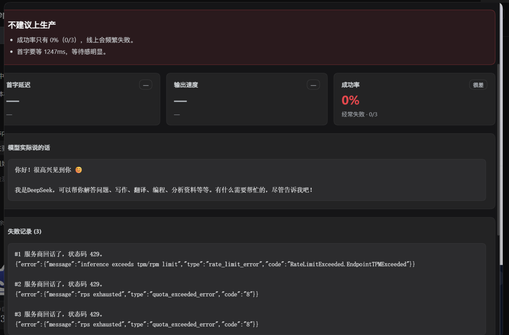

# API 体检（DeepSeek Harness 插件）

拿到一个陌生的 API 地址和 Key，不知道它到底能不能用、快不快？
装上这个插件，在 Harness 左侧栏点一下 **「API 体检」**，填两项，点一下按钮，30 秒给你答案。


<details>
<summary><b>English summary</b></summary>

Paste an API base URL and an API key, get a verdict in about 30 seconds: does it
work, is it fast, how fast, how reliable.

- **Time to first token**, **output speed (tok/s)** and **success rate** across N runs.
- **Four-layer diagnosis** — network (DNS / TCP / TLS / certificate expiry) → key and
  model → real streaming conversation → repeated timing runs.
- **Evidence-based failure attribution.** Every failure states which step it stalled
  at and how many bytes actually left your machine, so "nothing happened" stops
  meaning "the vendor is down".
- **37 provider presets** (OpenAI-compatible, Anthropic-native and Gemini-native),
  plus a custom entry for anything else.
- Model IDs are **never hardcoded** — the plugin asks the endpoint's own `/models`
  and offers what that server actually serves.
- Runs entirely on your machine. Your key is never written to disk or sent anywhere
  except the endpoint you are testing.

Three test suites, 230 checks, CI on Node 20 and 24 across Linux and Windows.
MIT licensed. Runs inside DeepSeek Harness (≥ 0.2.0-rc.2) as a plugin.

</details>

---

## 界面

**填好地址和 Key，点一下开始检测。**



**测完三个指标一目了然，失败时直接告诉你请求发出去没有。**

> 卡在第四步：115 字节的请求正文已经发出去了，服务商连 HTTP 状态行都没回。



**Key 有效但被限流时，它会直说是限流，不会含糊成「调不动模型」。**



**三轮全被掐时，指标显示「—」而不是编一个数，失败原文也一并列出。**



> 上面几张是在**免费额度**的服务商上测的，成功率没跑满——真实情况就是这样。
> 指标不会为了好看去修饰，缺数据就写「—」。

---

## 它给你什么

一句话结论，比如：

> **能用，而且很快** — 首字 0.42 秒，出字 68 字/秒，连测 5 次全成。

再加上三个数字：

| 数字 | 说的是什么 | 怎么看 |
|---|---|---|
| **首字延迟** | 你按下回车到第一个字出现要多久 | 越低越好。<0.5 秒几乎不用等，超过 2 秒会明显不耐烦 |
| **输出速度** | 模型每秒吐多少字 | 越高越顺。<8 就是一个字一个字蹦，>45 基本像看现成文字 |
| **成功率** | 连着测这么多次，成了几次 | 低于 80% 建议别上生产 |

**三个要一起看。** 首字很快但成功率只有 6 成，说明线路在抖——这种比稳定地慢两秒更难受。

## 它查四层，出错时告诉你是哪一层坏了

1. **网络** — 域名解析、端口连通、TLS 握手、证书还剩几天
2. **Key 和模型** — Key 有没有效；没指定模型时自动从对方列表里挑一个能对话的
3. **能不能真的说话** — 走完整流式，把模型输出的字直接显示给你
4. **快不快稳不稳** — 连续测 N 次，出首字延迟、速度、成功率

出错时不会丢一句 `HTTP 401` 就完事，而是直接翻译成人话：

| 你填错了 | 面板会告诉你 |
|---|---|
| Key 过期或打错 | Key 无效或没权限 |
| Key 有效但欠费 | 命中限流或额度用尽 |
| 地址路径不对 | 如实报出**实际请求的是哪个路径**，你自己和文档对一下 |
| 域名不存在 | 域名解析不了，检查拼写或 DNS |
| 被内容风控拦了 | 请求成功但正文是空的，可能是账号被风控 |

### 它会明确告诉你：请求到底发出去了没有

「没反应」有两种完全相反的情况，混在一起就会变成瞎猜。所以每一次失败都会标出**卡在第几步**，并且报出**实际写出去多少字节**：

| 卡在 | 发生了什么 | 接下来怎么办 |
|---|---|---|
| 第一步 · 连接 | TCP 都没建起来，**一个字节都没发出去** | 查网络、防火墙、域名端口 |
| 第二步 · TLS | TCP 通了但加密握手失败，请求没送出 | 看证书，或勾「忽略证书错误」试试 |
| 第三步 · 写入 | 连接活着，但请求写不进去 | 换网络（手机热点）或填代理 |
| 第四步 · 等回话 | **请求正文已经写出去了**，对方连 HTTP 状态行都没回 | 填代理、调大超时，或等上游 |
| 对端断连 | **请求写出去了**，对端一个字节都没给就关连接 | 被网关拦了、Key 被封、或线路不对 |
| 等不到正文 | 状态 200，但一个 token 都没等到 | 上游排队或卡死，隔几十秒重试 |

这张表不是装饰。以前只要出现「没回应」，面板一律显示成「调不动模型」——那是在替服务商下结论，而工具当时真正知道的只有「我自己这次请求卡住了」。现在结论会跟着证据走。

---

## 安装

### Windows（图形化，不需要敲命令）

1. 双击 **`安装.bat`**（或先双击 `自检.bat` 跑一遍自检）
2. 等它显示「Installed」
3. **把 DeepSeek Harness 完全关掉，再重新打开**
4. 左侧栏多出一个 **「API 体检」**，点进去

卸载：双击 `卸载.bat`，再重启一次 Harness。

> 安装脚本会自动寻找 DeepSeek Harness 的安装位置。如果它装在非常规目录，
> 先设一个环境变量再运行：
> `set DSH_CLI=D:\你的路径\DeepSeek Harness\resources\runtime\cli\bin\dsh.cmd`

### macOS / Linux / 任何地方

`.bat` 只在 Windows 上用得。直接调 CLI 即可：

```bash
dsh plugin --profile desktop add link:"/绝对路径/dsh-api-probe"
```

装完同样需要**完全重启** DeepSeek Harness —— 插件是启动时加载的，不热更新。

**前置条件**：DeepSeek Harness ≥ `0.2.0-rc.2`。安装前建议先跑一次 `自检.bat`
（或 `node tests/run_tests.js` 等三个套件）。

---

## 怎么用

1. **服务商** — 下拉里选你用的那家，地址会自动填好（37 个预设，覆盖 OpenAI 兼容、
   Anthropic 原生、Gemini 原生和本地 Ollama/LM Studio；没有就选「自定义」自己填）
2. **API 地址** — 对方给你的网址。**只填域名也行**，后面自动补 `/v1`；已经带路径的按原样使用
3. **API Key** — 粘贴进来
4. **模型名** — **推荐填上你打算用的那个模型名**，测的就是它。留空则由插件去调
   该地址的 `/models` 接口取真实列表，并以可点芯片呈现。填的名字不在列表里会提示
   「可能拼错了」并给出最接近的那个，**只警告不中断**
5. 点 **开始检测**

出来的结果可以直接点 **「复制报告」** 发给别人。

> **为什么预设里没有模型名？** 因为同一个模型在不同厂商的 ID 完全不同
> （NVIDIA 的 `deepseek-ai/deepseek-v4.1-flash`、Cloudflare 的
> `@cf/deepseek/deepseek-v4.1-flash`、深度求索官方的 `deepseek-chat` 是同一个东西），
> 中转站还会再改一次名，而且模型随时下架。过期的提示看起来很权威，却会直接把人
> 送进 400 错误。**该地址自己的 `/models` 响应是唯一不会腐烂的来源。**

### 关于 Key 的安全

- Key 只在这一次请求里用一下，**不写进任何文件**
- 面板下方的报告里 Key 是打码的（`sk-a****xyz`）
- 地址、模型、超时这些设置会记住，但**永远不记 Key**
- Key 的流向只有「你 → 你要测的那个服务商」，没有第三方

### 需要走网络代理？

展开 **「高级设置」**，在「代理地址」填 `http://127.0.0.1:7890`（换成你自己用的端口）。留空就是直连。

---

## 支持哪些接口

| 协议 | 说明 |
|---|---|
| **OpenAI 兼容** | 几乎所有中转站、国内厂商都走这个，默认就是这个 |
| **Anthropic 原生** | DeepSeek / Claude 的 `/messages` 接口 |
| **Google Gemini 原生** | Key 放在网址里那种 |

**37 个服务商预设**，涵盖阿里云百炼、百川、硅基流动、火山引擎、阶跃星辰、魔搭、
MiniMax、商汤、讯飞星火、月之暗面、智谱，以及 Anthropic、Baseten、Cerebras、
Chutes、Cloudflare Workers AI、DeepInfra、DeepSeek、Featherless、Fireworks、
Gemini、Groq、Hyperbolic、Mistral、Nebius、NVIDIA NIM、Novita、OpenAI、
OpenRouter、Perplexity、SambaNova、Together、xAI，以及本地 Ollama / LM Studio /
llama.cpp·one-api。

完整列表随时可以自己打印：

```bash
node tests/check_providers.mjs           # 打印全部预设 + 结构校验
node tests/check_providers.mjs --online  # 再逐个探测地址是否还活着
# 抽检几家（不必一次全打，避免对网关造成突发流量）：
node tests/check_providers.mjs --online --only=xfeng,deepseek,nvidia
```

---

## 开发者信息

```
dsh-api-probe/
├─ lib/index.js      宿主端：探测逻辑 + HTTP 路由
├─ lib/client.js     前端：React 面板（手写 createElement，无构建步骤）
├─ cordis.patch.yml  让插件出现在 Web 端插件名单里
├─ tests/
│  ├─ run_tests.js          129 项：探测逻辑、指标口径、各类故障
│  ├─ run_client_tests.mjs   75 项：界面数据契约与文案契约
│  ├─ run_route_tests.js     26 项：HTTP 路由、安全栅栏、NDJSON 流
│  ├─ mock_api.js            测试用假服务端
│  └─ check_providers.mjs    预设地址核对（离线结构 / 在线逐个探测）
└─ 安装.bat / 卸载.bat / 自检.bat
```

**跑测试（Node ≥ 20）：**

```bash
npm test                    # 三个套件一起跑
npm run check:providers     # 供应商预设结构校验
```

无需 `npm install` —— 本插件零第三方依赖。

> ⚠️ **三个套件都要跑。** 改 `PRESETS` 只跑 `run_tests.js` 是抓不到问题的，
> 而曾经有一次因为正则没跟着改，19 条断言静默失效、套件照样报绿。
> 详见 [CONTRIBUTING.md](CONTRIBUTING.md)。

### 设计上几个刻意的选择

**用裸 socket 而不是 `fetch`。** 首字延迟要的是每个数据块真实到达的时刻，`fetch`
的封装会把边界抹掉；顺带也躲开了宿主里 undici 全局分发的那个压缩头坑。代理支持
退化成 HTTP CONNECT 隧道。

**路由必须写文档相对路径（`api/...`，不带前导斜杠）。** Harness 用
`<base href="./">` 提供 GUI，写成 `/api/...` 会逃出部署前缀，请求根本到不了插件
（上游 issue #1707）。

**客户端不写 JSX。** 这个文件由浏览器直接执行，没有编译步骤，所以全程
`React.createElement`。

**只用 `react` 和 `react/jsx-runtime` 两个 require。** 这是宿主 `__ModuleLoader__`
唯一提供的东西。

**安全栅栏只有一份。** 探测路由要拿 Key 并向外拨任意 URL，所以必须 loopback-only：
socket 地址（`127/8`、`::1`、IPv4-mapped）+ Host 头 + `sec-fetch-site` / `Origin`
同源三重校验；`X-Forwarded-For` 一律不信。配对设备走 `remoteWebUiPairing` 单独放行。

**`state.cfg` 存的是打码副本。** 这个对象会原样回传浏览器并写进报告，明文 Key
不能留在里面——这是实际踩到过的坑。

**预设只存地址，不存模型名。** 厂商控制的字符串会腐烂，而我们自己编的字符串
同样会腐烂，两种都是给用户一个看起来很权威、实际把人送进 400 的答案。模型名
由该地址的 `/models` 决定；地址则用 `check_providers.mjs` 定期复核。

### 已知边界

- 诊断文案（报错解释、结论）是中文，界面上其余部分是中英双语。诊断文案只有
  宿主一份，避免两处维护漂移。
- 没有测 SSE 中途断流后的续传，也不支持流式中途改参数。
- HTTP/2 不支持（走 HTTP/1.1），对测速结果无影响。
- 预设里的 base URL 是**起点，不是保证**：厂商会不打招呼地换域名。
  `check_providers.mjs --online` 就是为此存在的。

---

## 参与贡献

欢迎提 Issue 和 PR。请先读 [CONTRIBUTING.md](CONTRIBUTING.md) —— 里面写清了
「三套件都要跑」和「不要给预设加模型名」这两条踩过坑才定下来的约定。

发现问题请用 [Bug 模板](.github/ISSUE_TEMPLATE/bug_report.yml)。
**请不要在 Issue 里贴任何真实的 API Key。**

安全问题请看 [SECURITY.md](SECURITY.md)，走私密上报，不要开公开 Issue。

## License

[MIT](LICENSE) © 2026 LFY-bot